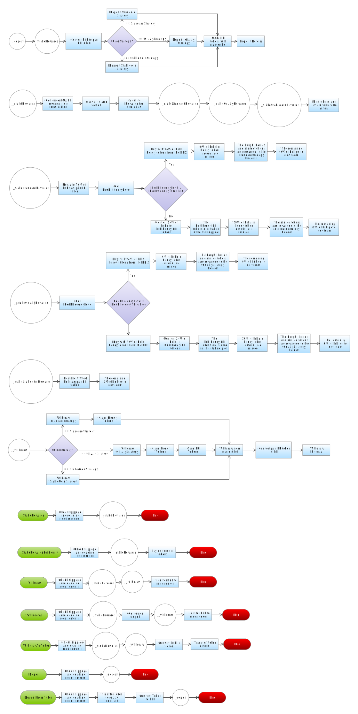

# Bug Bounty
https://immunefi.com/bounty/grizzlyfi/

# Contracts

This folder contains all contracts for grizzly.fi. In the root are the actual deployed contracts and the folders contain abstract contracts, interfaces and mock contracts.

## Grizzly.sol

This contract is the heart of grizzly.fi. It's the contract which is the gateway for the investors to deposit and withdraw their funds into the liquidity pools. The re-staking is performed within this contract and funds are split up between the investors. The following flow chart shows an overview of the most important functions and their processes:

## HoneyToken.sol

The HoneyToken.sol is the native token of grizzly.fi. It is implemented using the ERC20 standard and uses AccessControl implementation from Openzeppelin to restrict the minting of the token.

## StakingPool.sol

The StakingPool.sol contract is the staking pool for honey token and pays out lp and honey rewards.

## HoneyBNBFarm.sol

This is the staking contract for the Honey-BNB-LP tokens. It provides block rewards in Honey for the stakers.

## Referral.sol

The referral contract tracks all the referral deposits and withdraws. The referral is set up such that a user which gives a referral will receive additional rewards based on the amount of the rewards of the user that used the referral link.